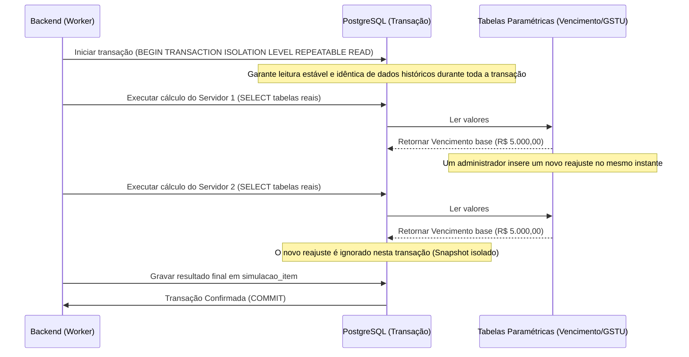

# Especificação de Arquitetura de Banco de Dados

**Sistema de Cálculo de Impacto Financeiro da UEFS**  
**Autor:** Arquiteto de Dados Sênior & Especialista em PostgreSQL  
**Data:** 10 de Julho de 2026  
**Versão:** 1.0 - Oficial  

---

## 1. Visão Geral da Arquitetura

Esta especificação define o modelo de dados físico, os mecanismos de integridade referencial, o controle de consistência temporal e as estratégias de auditoria transacional para o banco de dados do Sistema de Cálculo de Impacto Financeiro da UEFS (Universidade Estadual de Feira de Santana).

### Decisões Tecnológicas Centrais
- **SGBD:** PostgreSQL (versão 15+)
- **Chaves Primárias (PK):** UUID v4 gerado nativamente para garantir unicidade e isolamento em ambientes distribuídos e migrações.
- **Tipagem Financeira:** `DECIMAL(12,2)` para armazenar todos os valores salariais e monetários, evitando imprecisões de ponto flutuante.
- **Armazenamento de Dados Semi-Estruturados:** `JSONB` para logs de simulação, resultados detalhados rubrica por rubrica e payloads de auditoria, garantindo indexação e pesquisas eficientes em sub-propriedades.
- **Tratamento de Datas de Vigência Ativas:** Utilização da data de fim padrão `'9999-12-31'` para fechar faixas de vigência ativas, simplificando chaves de exclusão e otimizando pesquisas em ORMs.

---

## 2. Modelo Físico e Scripts DDL

Abaixo estão definidos os tipos enumerados, extensões obrigatórias e scripts de criação de tabelas. A política de deleção foi modelada de forma estrita: `ON DELETE RESTRICT` na maioria das tabelas para salvaguardar a integridade do histórico financeiro, exceto onde a exclusão em cascata é explicitamente exigida (`simulacao_item` e `usuario_perfil`).

```sql
-- ============================================================================
-- 1. EXTENSÕES E TIPOS ENUMERADOS
-- ============================================================================

-- Extensão para geração de UUID v4
CREATE EXTENSION IF NOT EXISTS "uuid-ossp";

-- Extensão para habilitar tipos de dados tradicionais (UUID, VARCHAR) no índice GiST
CREATE EXTENSION IF NOT EXISTS btree_gist;

-- Enums de Domínio
CREATE TYPE regime_previdenciario AS ENUM (
    'BAPREV_REGIME_PROPRIO',
    'PREVBAHIA_COMPLEMENTAR'
);

CREATE TYPE tipo_vinculo AS ENUM (
    'ESTATUTARIO',
    'REDA',
    'CLT'
);

CREATE TYPE tipo_cargo AS ENUM (
    'DOCENTE',
    'ANALISTA',
    'TECNICO',
    'AUXILIAR'
);

CREATE TYPE tipo_averbacao AS ENUM (
    'ATS',
    'APOSENTADORIA'
);

CREATE TYPE status_simulacao AS ENUM (
    'RASCUNHO',
    'PROCESSANDO',
    'FINALIZADO',
    'ERRO'
);

CREATE TYPE tipo_simulacao AS ENUM (
    'INDIVIDUAL',
    'LOTE'
);

CREATE TYPE operacao_log AS ENUM (
    'INSERT',
    'UPDATE',
    'DELETE',
    'LOGIN',
    'SIMULACAO_EXECUCAO'
);

-- ============================================================================
-- 2. CRIAÇÃO DAS TABELAS
-- ============================================================================

-- Tabela: servidor
CREATE TABLE servidor (
    id UUID PRIMARY KEY DEFAULT uuid_generate_v4(),
    cpf VARCHAR(11) UNIQUE NOT NULL,
    nome VARCHAR(150) NOT NULL,
    data_nascimento DATE NOT NULL,
    CONSTRAINT chk_servidor_cpf CHECK (length(cpf) = 11 AND cpf ~ '^[0-9]+$')
);

-- Tabela: cargo
CREATE TABLE cargo (
    id UUID PRIMARY KEY DEFAULT uuid_generate_v4(),
    nome VARCHAR(100) NOT NULL,
    tipo tipo_cargo NOT NULL,
    carga_horaria_padrao INTEGER NOT NULL CHECK (carga_horaria_padrao IN (20, 30, 40))
);

-- Tabela: vinculo
CREATE TABLE vinculo (
    id UUID PRIMARY KEY DEFAULT uuid_generate_v4(),
    servidor_id UUID NOT NULL REFERENCES servidor(id) ON DELETE RESTRICT,
    matricula VARCHAR(20) UNIQUE NOT NULL,
    data_admissao DATE NOT NULL,
    cargo_id UUID NOT NULL REFERENCES cargo(id) ON DELETE RESTRICT,
    regime_previdenciario regime_previdenciario NOT NULL,
    participante_prev_complementar BOOLEAN NOT NULL DEFAULT FALSE,
    aliquota_coparticipacao_complementar DECIMAL(4,2) NOT NULL DEFAULT 0.00,
    tipo_vinculo tipo_vinculo NOT NULL,
    ativo BOOLEAN NOT NULL DEFAULT TRUE,
    CONSTRAINT chk_aliquota CHECK (aliquota_coparticipacao_complementar >= 0.00 AND aliquota_coparticipacao_complementar <= 100.00)
);

-- Tabela: averbacao
CREATE TABLE averbacao (
    id UUID PRIMARY KEY DEFAULT uuid_generate_v4(),
    vinculo_id UUID NOT NULL REFERENCES vinculo(id) ON DELETE RESTRICT,
    dias_averbados INTEGER NOT NULL CHECK (dias_averbados > 0),
    tipo_averbacao tipo_averbacao NOT NULL,
    data_averbacao DATE NOT NULL,
    processo_numero VARCHAR(50) NOT NULL
);

-- Tabela: tabela_vencimento
CREATE TABLE tabela_vencimento (
    id UUID PRIMARY KEY DEFAULT uuid_generate_v4(),
    codigo_vencimento VARCHAR(20) NOT NULL,
    classe VARCHAR(50) NOT NULL,
    nivel_grau VARCHAR(10) NOT NULL,
    carga_horaria INTEGER NOT NULL CHECK (carga_horaria IN (20, 30, 40)),
    valor_base DECIMAL(12,2) NOT NULL CHECK (valor_base >= 0.00),
    data_inicio_vigencia DATE NOT NULL,
    data_fim_vigencia DATE NOT NULL DEFAULT '9999-12-31',
    CONSTRAINT chk_vigencia_vencimento CHECK (data_inicio_vigencia <= data_fim_vigencia)
);

-- Tabela: tabela_gstu
CREATE TABLE tabela_gstu (
    id UUID PRIMARY KEY DEFAULT uuid_generate_v4(),
    codigo_gstu VARCHAR(30) NOT NULL,
    grau VARCHAR(10) NOT NULL,
    referencia VARCHAR(10) NOT NULL,
    valor_gstu DECIMAL(12,2) NOT NULL CHECK (valor_gstu >= 0.00),
    data_inicio_vigencia DATE NOT NULL,
    data_fim_vigencia DATE NOT NULL DEFAULT '9999-12-31',
    CONSTRAINT chk_vigencia_gstu CHECK (data_inicio_vigencia <= data_fim_vigencia)
);

-- Tabela: tabela_comissao
CREATE TABLE tabela_comissao (
    id UUID PRIMARY KEY DEFAULT uuid_generate_v4(),
    simbolo VARCHAR(10) NOT NULL,
    valor_comissao DECIMAL(12,2) NOT NULL CHECK (valor_comissao >= 0.00),
    data_inicio_vigencia DATE NOT NULL,
    data_fim_vigencia DATE NOT NULL DEFAULT '9999-12-31',
    CONSTRAINT chk_vigencia_comissao CHECK (data_inicio_vigencia <= data_fim_vigencia)
);

-- Tabela: historico_funcional
CREATE TABLE historico_funcional (
    id UUID PRIMARY KEY DEFAULT uuid_generate_v4(),
    vinculo_id UUID NOT NULL REFERENCES vinculo(id) ON DELETE RESTRICT,
    data_inicio DATE NOT NULL,
    data_fim DATE NOT NULL DEFAULT '9999-12-31',
    tabela_vencimento_id UUID NOT NULL REFERENCES tabela_vencimento(id) ON DELETE RESTRICT,
    tabela_gstu_id UUID REFERENCES tabela_gstu(id) ON DELETE RESTRICT,
    cet_percentual DECIMAL(5,2) NOT NULL DEFAULT 0.00 CHECK (cet_percentual >= 0.00),
    insalubridade_percentual DECIMAL(5,2) NOT NULL DEFAULT 0.00 CHECK (insalubridade_percentual >= 0.00),
    vpess_valor DECIMAL(12,2) NOT NULL DEFAULT 0.00 CHECK (vpess_valor >= 0.00),
    tabela_comissao_id UUID REFERENCES tabela_comissao(id) ON DELETE RESTRICT,
    percentual_estabilizado DECIMAL(5,2) NOT NULL DEFAULT 0.00 CHECK (percentual_estabilizado >= 0.00 AND percentual_estabilizado <= 100.00),
    CONSTRAINT chk_vigencia_historico CHECK (data_inicio <= data_fim)
);

-- Tabela: usuario
CREATE TABLE usuario (
    id UUID PRIMARY KEY DEFAULT uuid_generate_v4(),
    username VARCHAR(50) UNIQUE NOT NULL,
    senha_hash VARCHAR(255) NOT NULL,
    nome VARCHAR(100) NOT NULL,
    email VARCHAR(100) UNIQUE NOT NULL,
    ativo BOOLEAN NOT NULL DEFAULT TRUE,
    criado_em TIMESTAMP NOT NULL DEFAULT CURRENT_TIMESTAMP
);

-- Tabela: perfil
CREATE TABLE perfil (
    id UUID PRIMARY KEY DEFAULT uuid_generate_v4(),
    nome VARCHAR(50) UNIQUE NOT NULL,
    descricao VARCHAR(200) NOT NULL
);

-- Tabela: usuario_perfil (N:N Associativa RBAC)
CREATE TABLE usuario_perfil (
    usuario_id UUID NOT NULL REFERENCES usuario(id) ON DELETE CASCADE,
    perfil_id UUID NOT NULL REFERENCES perfil(id) ON DELETE CASCADE,
    PRIMARY KEY (usuario_id, perfil_id)
);

-- Tabela: simulacao
CREATE TABLE simulacao (
    id UUID PRIMARY KEY DEFAULT uuid_generate_v4(),
    descricao VARCHAR(200) NOT NULL,
    tipo tipo_simulacao NOT NULL,
    status status_simulacao NOT NULL DEFAULT 'RASCUNHO',
    criado_por_usuario_id UUID NOT NULL REFERENCES usuario(id) ON DELETE RESTRICT,
    data_criacao TIMESTAMP NOT NULL DEFAULT CURRENT_TIMESTAMP
);

-- Tabela: simulacao_item (Participação em cenário)
CREATE TABLE simulacao_item (
    id UUID PRIMARY KEY DEFAULT uuid_generate_v4(),
    simulacao_id UUID NOT NULL REFERENCES simulacao(id) ON DELETE CASCADE,
    vinculo_id UUID NOT NULL REFERENCES vinculo(id) ON DELETE RESTRICT,
    data_vigencia_proposta DATE NOT NULL,
    mes_gozo_ferias_proposto INTEGER NOT NULL CHECK (mes_gozo_ferias_proposto >= 1 AND mes_gozo_ferias_proposto <= 12),
    dados_origem_json JSONB NOT NULL,
    dados_propostos_json JSONB NOT NULL,
    resultado_calculo_json JSONB NOT NULL,
    justificativa_requisitos TEXT
);

-- Tabela: audit_log (Rastreabilidade Central)
CREATE TABLE audit_log (
    id UUID PRIMARY KEY DEFAULT uuid_generate_v4(),
    usuario_id UUID REFERENCES usuario(id) ON DELETE RESTRICT,
    tabela_afetada VARCHAR(50) NOT NULL,
    registro_id UUID NOT NULL,
    operacao operacao_log NOT NULL,
    payload_antigo JSONB,
    payload_novo JSONB,
    ip_origem VARCHAR(45) NOT NULL DEFAULT '0.0.0.0',
    data_hora TIMESTAMP NOT NULL DEFAULT CURRENT_TIMESTAMP
);
```

---

## 3. Controle de Sobreposição Temporal (Integridade de Histórico)

Para evitar duplicidade de registros ativos ou sobreposição de datas em tabelas que gerenciam intervalos de vigência (`[data_inicio, data_fim]`), implementamos chaves de exclusão (`EXCLUDE USING gist`) a nível de banco de dados.

Com o suporte da extensão `btree_gist`, combinamos identificadores com intervalos do tipo `daterange`. A data `'9999-12-31'` é atribuída para vigências ativas, gerando uma cobertura temporal completa que impede colisões de datas para o mesmo código salarial ou vínculo funcional.

```sql
-- ============================================================================
-- 3. REGRAS DE EXCLUSÃO TEMPORAL (EXCLUDE USING GIST)
-- ============================================================================

-- Impedir sobreposição salarial para o mesmo código de vencimento-base
ALTER TABLE tabela_vencimento
ADD CONSTRAINT exclude_tabela_vencimento_overlap
EXCLUDE USING gist (
    codigo_vencimento WITH =,
    daterange(data_inicio_vigencia, data_fim_vigencia, '[]') WITH &&
);

-- Impedir sobreposição de gratificação GSTU para o mesmo código GSTU
ALTER TABLE tabela_gstu
ADD CONSTRAINT exclude_tabela_gstu_overlap
EXCLUDE USING gist (
    codigo_gstu WITH =,
    daterange(data_inicio_vigencia, data_fim_vigencia, '[]') WITH &&
);

-- Impedir sobreposição de valores de comissão para o mesmo símbolo
ALTER TABLE tabela_comissao
ADD CONSTRAINT exclude_tabela_comissao_overlap
EXCLUDE USING gist (
    simbolo WITH =,
    daterange(data_inicio_vigencia, data_fim_vigencia, '[]') WITH &&
);

-- Impedir sobreposição de histórico funcional para a mesma matrícula (vinculo_id)
ALTER TABLE historico_funcional
ADD CONSTRAINT exclude_historico_funcional_overlap
EXCLUDE USING gist (
    vinculo_id WITH =,
    daterange(data_inicio, data_fim, '[]') WITH &&
);
```

---

## 4. Auditoria Transacional PL/pgSQL (RNF006)

Em conformidade com as diretrizes de imutabilidade de dados críticos e parâmetros salariais, o script a seguir cria a função gatilho genérica `fn_auditar_alteracao_parametro()`. 

Esta função intercepta operações de gravação e lê as variáveis locais de sessão `app.current_user_id` e `app.current_ip` para preencher os dados do log. Se a gravação no log falhar, o PostgreSQL desfaz a operação inteira (Atomicidade Transacional).

```sql
-- ============================================================================
-- 4. FUNÇÃO E TRIGGER DE AUDITORIA TRANSACIONAL (RNF006)
-- ============================================================================

CREATE OR REPLACE FUNCTION fn_auditar_alteracao_parametro()
RETURNS TRIGGER AS $$
DECLARE
    v_usuario_id UUID;
    v_ip_origem VARCHAR(45);
    v_registro_id UUID;
    v_payload_antigo JSONB := NULL;
    v_payload_novo JSONB := NULL;
BEGIN
    -- 1. Captura do usuário da sessão definida pelo middleware com tratamento seguro
    BEGIN
        v_usuario_id := NULLIF(current_setting('app.current_user_id', true), '')::UUID;
    EXCEPTION WHEN OTHERS THEN
        v_usuario_id := NULL; -- Trata erro se a variável não estiver definida
    END;

    -- 2. Captura do IP de origem da requisição
    BEGIN
        v_ip_origem := COALESCE(NULLIF(current_setting('app.current_ip', true), ''), '0.0.0.0');
    EXCEPTION WHEN OTHERS THEN
        v_ip_origem := '0.0.0.0'; -- Fallback padrão
    END;

    -- 3. Identificação da operação e estruturação dos payloads
    IF (TG_OP = 'INSERT') THEN
        v_registro_id := NEW.id;
        v_payload_novo := to_jsonb(NEW);
    ELSIF (TG_OP = 'UPDATE') THEN
        v_registro_id := NEW.id;
        v_payload_antigo := to_jsonb(OLD);
        v_payload_novo := to_jsonb(NEW);
    ELSIF (TG_OP = 'DELETE') THEN
        v_registro_id := OLD.id;
        v_payload_antigo := to_jsonb(OLD);
    END IF;

    -- 4. Gravação atômica no log de auditoria
    INSERT INTO audit_log (
        usuario_id,
        tabela_afetada,
        registro_id,
        operacao,
        payload_antigo,
        payload_novo,
        ip_origem,
        data_hora
    ) VALUES (
        v_usuario_id,
        TG_TABLE_NAME,
        v_registro_id,
        TG_OP::operacao_log,
        v_payload_antigo,
        v_payload_novo,
        v_ip_origem,
        CURRENT_TIMESTAMP
    );

    -- Retorna o registro apropriado para prosseguir com a transação
    IF (TG_OP = 'DELETE') THEN
        RETURN OLD;
    ELSE
        RETURN NEW;
    END IF;
END;
$$ LANGUAGE plpgsql SECURITY DEFINER;

-- ============================================================================
-- 5. ATRIBUIÇÃO DOS TRIGGERS ÀS TABELAS CRÍTICAS
-- ============================================================================

-- Tabelas Salariais
CREATE TRIGGER trg_audit_tabela_vencimento
AFTER INSERT OR UPDATE OR DELETE ON tabela_vencimento
FOR EACH ROW EXECUTE FUNCTION fn_auditar_alteracao_parametro();

CREATE TRIGGER trg_audit_tabela_gstu
AFTER INSERT OR UPDATE OR DELETE ON tabela_gstu
FOR EACH ROW EXECUTE FUNCTION fn_auditar_alteracao_parametro();

CREATE TRIGGER trg_audit_tabela_comissao
AFTER INSERT OR UPDATE OR DELETE ON tabela_comissao
FOR EACH ROW EXECUTE FUNCTION fn_auditar_alteracao_parametro();

-- Tabelas de Controle de Acesso (RBAC)
CREATE TRIGGER trg_audit_usuario
AFTER INSERT OR UPDATE OR DELETE ON usuario
FOR EACH ROW EXECUTE FUNCTION fn_auditar_alteracao_parametro();

CREATE TRIGGER trg_audit_perfil
AFTER INSERT OR UPDATE OR DELETE ON perfil
FOR EACH ROW EXECUTE FUNCTION fn_auditar_alteracao_parametro();
```

---

## 5. Estratégia de Indexação

Para otimizar os fluxos de consulta mais comuns e mitigar gargalos em lote, o seguinte plano de indexação foi definido.

```sql
-- ============================================================================
-- 6. CRIAÇÃO DE ÍNDICES ADICIONAIS
-- ============================================================================

-- Otimização de junção (Servidor <-> Vínculo)
CREATE INDEX idx_vinculo_servidor_id ON vinculo (servidor_id);
CREATE INDEX idx_vinculo_cargo_id ON vinculo (cargo_id);

-- Otimização de consultas do prontuário (Averbações por vínculo)
CREATE INDEX idx_averbacao_vinculo_id ON averbacao (vinculo_id);

-- Otimização para carregamento rápido dos itens do cenário de simulação
CREATE INDEX idx_simulacao_item_simulacao_id ON simulacao_item (simulacao_id);
CREATE INDEX idx_simulacao_item_vinculo_id ON simulacao_item (vinculo_id);

-- Otimização de consultas de auditoria por data e tabela
CREATE INDEX idx_audit_log_tabela_data ON audit_log (tabela_afetada, data_hora DESC);
CREATE INDEX idx_audit_log_registro_id ON audit_log (registro_id);

-- ============================================================================
-- Índices GIN para payloads JSONB
-- Permite queries de alta performance dentro de campos JSONB
-- ============================================================================

-- Permite buscar vínculos simulados com base no cargo/vencimento proposto
CREATE INDEX idx_simulacao_item_dados_propostos ON simulacao_item USING gin (dados_propostos_json);

-- Permite extrair rapidamente estatísticas de erros ou valores nas rubricas calculadas
CREATE INDEX idx_simulacao_item_resultado_calculo ON simulacao_item USING gin (resultado_calculo_json);
```

### Justificativa de Índices
1. **Índices de Chaves Estrangeiras:** O PostgreSQL não cria índices em FKs de forma automática. A ausência de índices em `vinculo(servidor_id)` e `simulacao_item(simulacao_id)` degradaria gravemente a performance de joins e deleções em cascata.
2. **Índices GIN:** O operador de continuação (`@>`) e busca de caminhos estruturados dentro do campo `resultado_calculo_json` (ex: obter simulações com diferença de ATS acima de um limite orçamentário) é mapeado de forma extremamente performática por índices invertidos generalizados (GIN).
3. **Índices GiST de Vigência:** Graças à restrição de exclusão temporal, o PostgreSQL já mantém índices GiST sobre as faixas de datas das tabelas salariais e históricas. Consultas usando sobreposições ou enquadramentos de data serão resolvidas diretamente pelo índice GiST.

---

## 6. Fluxo de Concorrência e Níveis de Isolamento

No processamento assíncrono de cálculos em lote (RF005), o banco de dados deve lidar com concorrência rigorosa para evitar leituras inconsistentes e garantir precisão nos relatórios orçamentários consolidados.



### Resolução de Anomalias de Concorrência
1. **Dirty Reads (Leituras Sujas):** Evitado pelo nível padrão do PostgreSQL (`READ COMMITTED`). Nenhuma simulação ou cálculo poderá ler tabelas salariais modificadas por outras transações que ainda não foram confirmadas (commit).
2. **Non-Repeatable Reads (Leituras Não-Repetíveis):** Durante a execução de uma simulação coletiva de lote (que pode demorar vários segundos para ler dezenas de servidores), dados de referências salariais não podem mudar no meio do processo. 
   - **Solução:** O worker que processa a fila do lote deve usar o nível de isolamento **`REPEATABLE READ`**.
   - **Mecanismo:** Ao iniciar com `REPEATABLE READ`, o PostgreSQL captura um snapshot dos dados no início da transação. Qualquer alteração ou reajuste feito nas tabelas de vencimento por terceiros após o início da execução do lote será invisível para aquele processamento, garantindo que o cálculo de todos os 150+ servidores utilize rigorosamente a mesma base paramétrica.
3. **Phantom Reads (Leituras Fantasmas):** Não ocorrem no PostgreSQL no nível `REPEATABLE READ`, pois a implementação de snapshot isolado previne nativamente essa anomalia sem exigir bloqueios exclusivos de tabelas inteiras.
