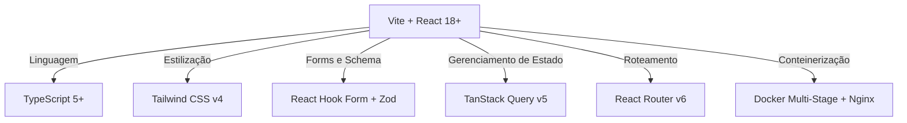
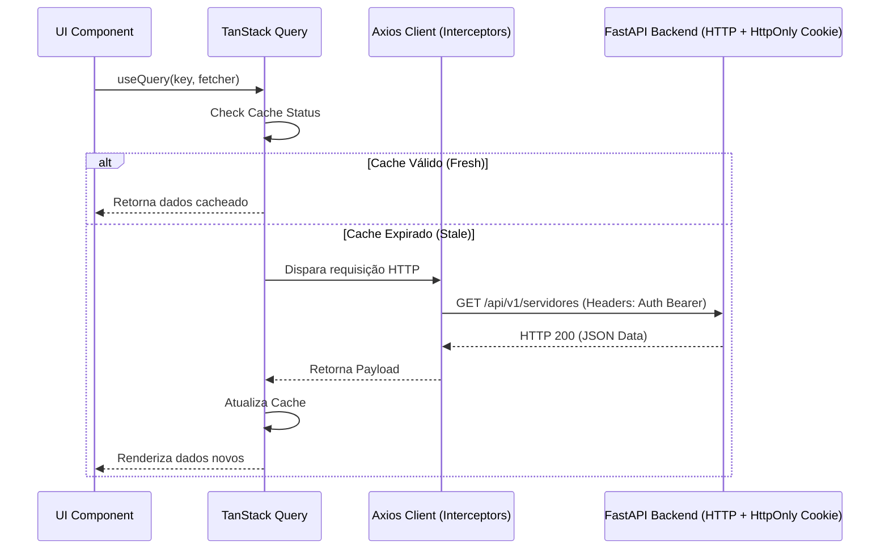
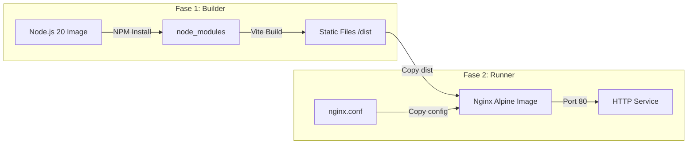

# Especificação de Arquitetura de Frontend

**Sistema de Cálculo de Impacto Financeiro da UEFS**  
**Autor:** Arquiteto de Frontend Sênior / Especialista em Sistemas Corporativos  
**Data:** 10 de Julho de 2026  
**Versão:** 1.0 - Oficial  
**Status:** Aprovado (Decisões do Socratic Gate Consolidadas)

---

## 1. Stack Tecnológica Base

Para atender aos requisitos de **simplicidade**, **manutenibilidade**, **segurança contra vazamento de dados** e **empacotamento leve**, a stack de frontend é definida conforme o diagrama e especificações a seguir:



### 1.1. Detalhamento e Raciocínio das Escolhas

1. **React 18+ (Ecossistema Base)**:
   * **Liderança e Maturidade**: O React possui o ecossistema mais maduro para a construção de dashboards corporativos complexos, com ampla variedade de componentes de tabelas, gráficos e utilitários.
   * **SPA Pura (Single Page Application)**: Como o sistema é de uso interno (para analistas de RH e auditores da UEFS), frameworks de SSR pesados (como Next.js ou Nuxt) são descartados para evitar complexidade de infraestrutura. Uma SPA clássica servida estaticamente via Nginx atende perfeitamente à necessidade de velocidade após o carregamento inicial.

2. **Vite (Bundler e Build System)**:
   * **Velocidade de Desenvolvimento**: Substitui o antigo *Create React App / Webpack* por build instantâneo baseado em ESM (Esbuild).
   * **Otimização de Produção**: O Rollup no build final garante divisão de código (code-splitting) otimizada, removendo código morto (tree-shaking) e gerando um bundle final ultracompacto.

3. **TypeScript (Linguagem)**:
   * **Tipagem Forte e Sincronização de Contratos**: Imprescindível para espelhar as estruturas de DTO do backend em FastAPI. Garante que erros de integração sejam pegos em tempo de compilação, prevenindo falhas de processamento de rubricas salariais e valores decimais no cliente.

4. **Tailwind CSS (Estilização)**:
   * **Componentização Visual Consistente**: Permite criar componentes responsivos e customizados rapidamente através de classes utilitárias, sem a necessidade de folhas de estilo externas ou de bibliotecas CSS-in-JS pesadas que degradam a performance de renderização.
   * **Geometria Corporativa**: Utilização de bordas limpas e afiadas (ex: `rounded-sm` a `rounded-md`, 2px a 6px) para passar sobriedade e seriedade de um sistema público/financeiro, fugindo de clichês visuais ultra-arredondados de ferramentas SaaS comuns.

---

## 2. Integração com API e Gerenciamento de Estado

Para otimizar o fluxo de dados, a comunicação com o backend assíncrono e a segurança das sessões dos analistas da UEFS, dividimos o gerenciamento de estado em duas frentes: **Estado do Servidor (Cache)** e **Segurança de Sessão (Tokens em Memória + Cookies)**.

### 2.1. Arquitetura de Sincronização de Dados



### 2.2. Cliente HTTP e Interceptor de Autenticação

Para mitigar ataques de **XSS (Cross-Site Scripting)**, o **Access Token** é mantido estritamente em memória (JavaScript State). O **Refresh Token** é armazenado pelo navegador em um **Cookie HttpOnly com flag Secure e SameSite=Strict**, o qual é injetado automaticamente pelo browser nas requisições de renovação e não pode ser lido por nenhum script cliente.

Abaixo está o design técnico da configuração do cliente Axios e seu interceptor em `src/lib/axios.ts`:

```typescript
import axios, { AxiosInstance, InternalAxiosRequestConfig } from 'axios';

// Estado em memória para armazenar temporariamente o Access Token
let memoryToken: string | null = null;

export const setAccessToken = (token: string | null) => {
  memoryToken = token;
};

export const getAccessToken = () => memoryToken;

export const api: AxiosInstance = axios.create({
  baseURL: import.meta.env.VITE_API_URL || '/api/v1',
  withCredentials: true, // Garante que cookies HttpOnly (Refresh Token) sejam enviados
  headers: {
    'Content-Type': 'application/json',
  },
});

// Interceptor de Requisição: Injeta o Access Token em memória no header Authorization
api.interceptors.request.use(
  (config: InternalAxiosRequestConfig) => {
    const token = getAccessToken();
    if (token && config.headers) {
      config.headers.Authorization = `Bearer ${token}`;
    }
    return config;
  },
  (error) => Promise.reject(error)
);

// Interceptor de Resposta: Trata expiração do Access Token (Erro 401) silenciosamente
let isRefreshing = false;
let failedQueue: any[] = [];

const processQueue = (error: any, token: string | null = null) => {
  failedQueue.forEach((prom) => {
    if (error) {
      prom.reject(error);
    } else {
      prom.resolve(token);
    }
  });
  failedQueue = [];
};

api.interceptors.response.use(
  (response) => response,
  async (error) => {
    const originalRequest = error.config;

    // Evita loop infinito se falhar no login ou no próprio endpoint de refresh
    if (error.response?.status === 401 && !originalRequest._retry && !originalRequest.url.includes('/auth/login') && !originalRequest.url.includes('/auth/refresh')) {
      if (isRefreshing) {
        return new Promise((resolve, reject) => {
          failedQueue.push({ resolve, reject });
        })
          .then((token) => {
            originalRequest.headers.Authorization = `Bearer ${token}`;
            return api(originalRequest);
          })
          .catch((err) => Promise.reject(err));
      }

      originalRequest._retry = true;
      isRefreshing = true;

      try {
        // Envia requisição para renovar os tokens (o Refresh Token vai automaticamente no Cookie)
        const response = await axios.post(
          `${import.meta.env.VITE_API_URL || '/api/v1'}/auth/refresh`,
          {},
          { withCredentials: true }
        );

        const { access_token } = response.data;
        setAccessToken(access_token);

        processQueue(null, access_token);
        isRefreshing = false;

        originalRequest.headers.Authorization = `Bearer ${access_token}`;
        return api(originalRequest);
      } catch (refreshError) {
        processQueue(refreshError, null);
        isRefreshing = false;
        
        // Limpa o token em memória e força o redirecionamento para o login
        setAccessToken(null);
        window.dispatchEvent(new CustomEvent('auth-logout'));
        return Promise.reject(refreshError);
      }
    }

    return Promise.reject(error);
  }
);
```

### 2.3. Configuração do TanStack Query

O TanStack Query será inicializado centralizadamente na aplicação, definindo tempos de cache coerentes com a volatilidade dos dados de folha salarial da UEFS (dados de parâmetros como tabelas são mais estáticos, enquanto simulações de impacto mudam constantemente):

```typescript
// src/lib/react-query.ts
import { QueryClient } from '@tanstack/react-query';

export const queryClient = new QueryClient({
  defaultOptions: {
    queries: {
      refetchOnWindowFocus: false, // Evita disparos desnecessários ao alternar abas do browser
      retry: (failureCount, error: any) => {
        // Não retenta requisições que retornaram erros de permissão ou não encontrados (401, 403, 404)
        if (error?.response?.status && [401, 403, 404].includes(error.response.status)) {
          return false;
        }
        return failureCount < 3;
      },
      staleTime: 1000 * 60 * 5, // 5 minutos: tempo em que o dado é considerado "fresco"
      gcTime: 1000 * 60 * 30, // 30 minutos: tempo até limpar dados inativos da memória
    },
  },
});
```

---

## 3. Estrutura de Diretórios (Design Pattern)

Para manter a escalabilidade, adotamos uma organização baseada em **Features (Domínios de Negócio)**. Essa abordagem encapsula a lógica de negócio, rotas, tipos e componentes em uma única pasta de domínio, facilitando a navegação e manutenção do código por novos programadores, ao invés de dispersar arquivos correlatos em diretórios globais gigantescos.

```
src/
├── assets/                    # Arquivos estáticos globais (imagens, logos, CSS global)
├── components/                # Componentes compartilhados comuns (Botões, Inputs, Modal, Sidebar, Table)
│   ├── ui/                    # Componentes atômicos puros e estilizados (design tokens)
│   └── layouts/               # Shells de layout (AppLayout.tsx, AuthLayout.tsx)
├── config/                    # Configurações de ambiente, constantes do sistema e enums
├── features/                  # Módulos de domínio de negócio isolados
│   ├── auth/                  # Módulo de Login e Sessão
│   │   ├── components/        # LoginForm.tsx, LoginCard.tsx
│   │   ├── hooks/             # useAuth.ts (login, logout, refresh wrapper)
│   │   ├── services/          # auth.api.ts (chamadas ao backend)
│   │   ├── schemas/           # auth.schema.ts (validação Zod)
│   │   └── types/             # auth.types.ts (DTOs do token)
│   ├── servidores/            # Módulo de Servidores e Evolução Funcional
│   │   ├── components/        # ServidoresTable.tsx, ServidorForm.tsx, HistoricoFuncional.tsx
│   │   ├── hooks/             # useServidores.ts, useMutateServidor.ts
│   │   ├── services/          # servidores.api.ts
│   │   ├── schemas/           # servidores.schema.ts
│   │   └── types/             # servidores.types.ts
│   ├── parametros/            # Módulo de Tabelas Salariais e Fatores de Cálculo
│   │   ├── components/        # TabelasVencimentoList.tsx, GstuConfigForm.tsx
│   │   ├── hooks/             # useParametros.ts, useMutateParametros.ts
│   │   ├── services/          # parametros.api.ts
│   │   ├── schemas/           # parametros.schema.ts
│   │   └── types/             # parametros.types.ts
│   └── simulacoes/            # Motor de Simulação de Impacto Financeiro (Individual/Lote)
│       ├── components/        # SimulacaoForm.tsx, ItemSimuladoCard.tsx, PainelImpactoLote.tsx
│       ├── hooks/             # useSimulacoes.ts, useProcessarSimulacao.ts
│       ├── services/          # simulacoes.api.ts
│       ├── schemas/           # simulacoes.schema.ts
│       └── types/             # simulacoes.types.ts
├── hooks/                     # Custom hooks utilitários globais (useDebounce, useMediaQuery)
├── lib/                       # Instâncias configuradas de bibliotecas (axios.ts, react-query.ts)
├── routes/                    # Configurações de rotas e middleware de rotas protegidas (guards)
│   ├── index.tsx              # Definições da árvore de rotas (React Router)
│   └── ProtectedRoute.tsx     # Guarda de autenticação e RBAC
├── utils/                     # Funções auxiliares puras (formatadores de moeda, datas, cálculos de validação)
│   ├── format.ts              # Formatadores (BRL, CPF, Datas)
│   └── math.ts                # Wrapper seguro para arredondamento financeiro
├── App.tsx                    # Ponto de montagem global de Providers (QueryClient, Auth, Router)
└── main.tsx                   # Entrada principal do React
```

---

## 4. Tratamento de Formulários e Validação

O sistema lidará com parâmetros e valores salariais críticos, exigindo validação estrita no cliente para reduzir requisições inválidas à API FastAPI. 

### 4.1. React Hook Form + Zod

Utilizaremos o **React Hook Form** (devido ao seu controle *uncontrolled* de inputs, prevenindo re-renderizações a cada caractere digitado) associado ao **Zod** para validação estrita do esquema e geração de tipos TypeScript em tempo real.

#### Exemplo de Validação: Inclusão de Novo Parâmetro de Vencimento

Abaixo está o design de implementação de um schema de validação para as tabelas salariais (`src/features/parametros/schemas/parametro.schema.ts`):

```typescript
import { z } from 'zod';

export const vencimentoSchema = z.object({
  codigo_vencimento: z
    .string()
    .min(3, 'O código de vencimento deve conter no mínimo 3 caracteres')
    .max(50, 'Limite de 50 caracteres excedido')
    .regex(/^[A-Z0-9_-]+$/, 'Apenas letras maiúsculas, números, hífen ou underline são permitidos'),
  
  classe: z.string().min(1, 'A classe é obrigatória (ex: Classe A)'),
  
  nivel_grau: z.string().min(1, 'O nível/grau é obrigatório (ex: III)'),
  
  carga_horaria: z
    .number({ invalid_type_error: 'Informe um valor numérico para a carga horária' })
    .int('A carga horária deve ser um número inteiro')
    .min(20, 'A carga horária mínima é de 20 horas')
    .max(40, 'A carga horária máxima é de 40 horas'),
  
  valor_base: z
    .number({ invalid_type_error: 'Informe um valor numérico válido para o vencimento base' })
    .positive('O valor deve ser maior que zero')
    .max(100000, 'Valor acima do limite máximo permitido para simulação'),
  
  data_inicio_vigencia: z
    .string()
    .regex(/^\d{4}-\d{2}-\d{2}$/, 'Formato de data inválido (AAAA-MM-DD)')
    .refine((date) => !isNaN(Date.parse(date)), {
      message: 'Data de início inválida',
    }),
    
  data_fim_vigencia: z
    .string()
    .regex(/^\d{4}-\d{2}-\d{2}$/, 'Formato de data inválido (AAAA-MM-DD)')
    .optional()
    .or(z.literal('')),
}).refine((data) => {
  if (data.data_fim_vigencia && data.data_fim_vigencia !== '') {
    return new Date(data.data_inicio_vigencia) <= new Date(data.data_fim_vigencia);
  }
  return true;
}, {
  message: 'A data de fim da vigência deve ser posterior à data de início',
  path: ['data_fim_vigencia'],
});

// Inferência do tipo TypeScript a partir do Schema Zod
export type VencimentoInput = z.infer<typeof vencimentoSchema>;
```

#### Integração no Componente React

```tsx
// src/features/parametros/components/ParametroForm.tsx
import React from 'react';
import { useForm } from 'react-hook-form';
import { zodResolver } from '@hookform/resolvers/zod';
import { vencimentoSchema, VencimentoInput } from '../schemas/parametro.schema.ts';

export function ParametroForm({ onSubmit }: { onSubmit: (data: VencimentoInput) => void }) {
  const {
    register,
    handleSubmit,
    formState: { errors, isSubmitting },
  } = useForm<VencimentoInput>({
    resolver: zodResolver(vencimentoSchema),
    defaultValues: {
      carga_horaria: 40,
      data_inicio_vigencia: new Date().toISOString().split('T')[0],
    }
  });

  return (
    <form onSubmit={handleSubmit(onSubmit)} className="space-y-4 max-w-md bg-white p-6 border border-gray-200">
      <div>
        <label className="block text-xs font-semibold text-gray-700 uppercase tracking-wider mb-1">Código Vencimento</label>
        <input
          {...register('codigo_vencimento')}
          className="w-full text-sm border-gray-300 focus:ring-1 focus:ring-black focus:border-black rounded-none"
          placeholder="ex: ANALISTA-CL-C"
        />
        {errors.codigo_vencimento && (
          <p className="mt-1 text-xs text-red-600">{errors.codigo_vencimento.message}</p>
        )}
      </div>

      <div>
        <label className="block text-xs font-semibold text-gray-700 uppercase tracking-wider mb-1">Valor Base (R$)</label>
        <input
          type="number"
          step="0.01"
          {...register('valor_base', { valueAsNumber: true })}
          className="w-full text-sm border-gray-300 focus:ring-1 focus:ring-black focus:border-black rounded-none"
          placeholder="0.00"
        />
        {errors.valor_base && (
          <p className="mt-1 text-xs text-red-600">{errors.valor_base.message}</p>
        )}
      </div>

      {/* Outros campos omitidos por brevidade */}

      <button
        type="submit"
        disabled={isSubmitting}
        className="w-full bg-black text-white py-2 text-sm uppercase tracking-widest font-semibold hover:bg-gray-900 disabled:bg-gray-400 transition-colors"
      >
        {isSubmitting ? 'Processando...' : 'Cadastrar Parâmetro'}
      </button>
    </form>
  );
}
```

---

## 5. Roteamento e Controle de Acesso (RBAC)

O roteamento será implementado com a biblioteca **React Router v6**. O controle de acesso do usuário é verificado de forma centralizada por meio de um componente Wrapper de Rotas Protegidas (`ProtectedRoute.tsx`), avaliando a role (`ADMINISTRADOR`, `ANALISTA_RH`, `AUDITOR`) correspondente.

### 5.1. Matriz de Acesso do Frontend (RBAC)

| Perfil | Descrição | Acesso às Rotas e Telas no Frontend |
| :--- | :--- | :--- |
| **ADMINISTRADOR** | Administrador Geral do Sistema | Acesso a tudo, incluindo gestão de usuários e logs de auditoria. |
| **ANALISTA_RH** | Gestor da Folha salarial / Simulações | Cadastro de Servidores e Criação de Simulações; Visualização (Somente Leitura) de Parâmetros. Bloqueado de painéis administrativos de auditoria pura. |
| **AUDITOR** | Analista de auditoria e controle | Apenas visualização de relatórios, relatórios consolidados e logs de alterações. Bloqueado de criar/editar servidores ou rodar simulações. |

### 5.2. Implementação do Componente `ProtectedRoute`

```tsx
// src/routes/ProtectedRoute.tsx
import React from 'react';
import { Navigate, Outlet, useLocation } from 'react-router-dom';

export type UserRole = 'ADMINISTRADOR' | 'ANALISTA_RH' | 'AUDITOR';

interface ProtectedRouteProps {
  allowedRoles?: UserRole[];
}

// Simulando um hook de autenticação de sessão
import { useAuth } from '../features/auth/hooks/useAuth.ts';

export function ProtectedRoute({ allowedRoles }: ProtectedRouteProps) {
  const { user, isAuthenticated, isLoading } = useAuth();
  const location = useLocation();

  if (isLoading) {
    return (
      <div className="flex h-screen w-screen items-center justify-center bg-gray-50">
        <div className="text-center">
          <div className="h-8 w-8 animate-spin rounded-full border-2 border-black border-t-transparent mx-auto"></div>
          <p className="mt-2 text-xs uppercase tracking-wider text-gray-500 font-semibold">Verificando sessão...</p>
        </div>
      </div>
    );
  }

  // 1. Verifica se está autenticado
  if (!isAuthenticated || !user) {
    return <Navigate to="/login" state={{ from: location }} replace />;
  }

  // 2. Verifica se a role do usuário está autorizada
  if (allowedRoles && !allowedRoles.includes(user.role as UserRole)) {
    return <Navigate to="/unauthorized" replace />;
  }

  // Se tudo estiver certo, renderiza as rotas filhas
  return <Outlet />;
}
```

### 5.3. Definição da Árvore de Rotas da Aplicação

```tsx
// src/routes/index.tsx
import React from 'react';
import { createBrowserRouter, Navigate } from 'react-router-dom';
import { ProtectedRoute } from './ProtectedRoute.tsx';

// Layouts
import { AppLayout } from '../components/layouts/AppLayout.tsx';
import { AuthLayout } from '../components/layouts/AuthLayout.tsx';

// Páginas de Recursos (Placeholders/Implementações Futuras)
import { LoginPage } from '../features/auth/components/LoginPage.tsx';
import { ServidoresDashboard } from '../features/servidores/components/ServidoresDashboard.tsx';
import { ParametrosDashboard } from '../features/parametros/components/ParametrosDashboard.tsx';
import { SimulacaoDashboard } from '../features/simulacoes/components/SimulacaoDashboard.tsx';
import { UnauthorizedPage } from '../components/ui/UnauthorizedPage.tsx';

export const router = createBrowserRouter([
  // Rotas Públicas / Layout de Autenticação
  {
    element: <AuthLayout />,
    children: [
      { path: '/login', element: <LoginPage /> },
      { path: '/unauthorized', element: <UnauthorizedPage /> },
    ],
  },
  
  // Rotas Protegidas / Layout do Dashboard Administrativo
  {
    element: <ProtectedRoute />, // Apenas garante autenticação geral
    children: [
      {
        element: <AppLayout />,
        children: [
          // Rota Raiz: Redireciona de acordo com o padrão
          { path: '/', element: <Navigate to="/dashboard/simulacoes" replace /> },

          // Rotas Acessíveis por ADMINISTRADOR e ANALISTA_RH (Gestão e Simulação)
          {
            element: <ProtectedRoute allowedRoles={['ADMINISTRADOR', 'ANALISTA_RH']} />,
            children: [
              { path: '/dashboard/servidores', element: <ServidoresDashboard /> },
              { path: '/dashboard/parametros', element: <ParametrosDashboard /> },
            ],
          },

          // Rotas Acessíveis por Todos os Autenticados (incluindo AUDITOR)
          {
            element: <ProtectedRoute allowedRoles={['ADMINISTRADOR', 'ANALISTA_RH', 'AUDITOR']} />,
            children: [
              { path: '/dashboard/simulacoes', element: <SimulacaoDashboard /> },
              // Rota para exportar/ver o PDF gerado pelo backend
              { path: '/dashboard/simulacoes/:id/relatorio', element: <SimulacaoDashboard /> }, 
            ],
          },
        ],
      },
    ],
  },
  
  // Rota Fallback para 404 Not Found
  { path: '*', element: <Navigate to="/" replace /> },
]);
```

### 5.4. Controle de Visibilidade de Interface (UI Triggers)

Para ocultar botões de edição ou links de exclusão de acordo com o perfil logado, utilizaremos um hook auxiliar `useHasRole` que permite renderização condicional simples:

```tsx
// src/hooks/useHasRole.ts
import { useAuth } from '../features/auth/hooks/useAuth.ts';
import { UserRole } from '../routes/ProtectedRoute.tsx';

export function useHasRole() {
  const { user } = useAuth();
  
  const hasRole = (roles: UserRole[]) => {
    return user ? roles.includes(user.role as UserRole) : false;
  };

  return { hasRole, userRole: user?.role as UserRole | undefined };
}

// Exemplo de uso em listagens para analistas:
// const { hasRole } = useHasRole();
// ...
// {hasRole(['ADMINISTRADOR', 'ANALISTA_RH']) && (
//   <button onClick={handleExcluir}>Excluir Registro</button>
// )}
```

---

## 6. Estratégia de Conteinerização (Docker)

O empacotamento do frontend em contêineres Docker utiliza a estratégia de **Multi-stage Build** para garantir um artefato final de produção extremamente leve e seguro. O contêiner de execução final contém apenas o servidor Nginx compilado em Alpine Linux e os arquivos estáticos compilados do React, sem qualquer código-fonte, dependência Node ou compilador do host de desenvolvimento.



### 6.1. Dockerfile de Produção

Abaixo está o arquivo `Dockerfile` de produção, projetado para ficar na raiz do repositório frontend:

```dockerfile
# ============================================================================
# FASE 1: Builder (Instalação e Compilação dos ativos estáticos)
# ============================================================================
FROM node:20-alpine AS builder

WORKDIR /app

# Copia arquivos de definição de dependências
COPY package.json package-lock.json ./

# Instalação limpa de dependências para evitar inconsistências
RUN npm ci

# Copia arquivos de configuração e código fonte
COPY tsconfig.json tsconfig.node.json vite.config.ts postcss.config.js tailwind.config.js index.html ./
COPY src/ ./src/

# Define variáveis de ambiente de build caso necessário
ARG VITE_API_URL
ENV VITE_API_URL=$VITE_API_URL

# Executa o build de produção (gera o diretório /app/dist)
RUN npm run build

# ============================================================================
# FASE 2: Runner (Servidor Web Nginx Alpine minimalista)
# ============================================================================
FROM nginx:1.25-alpine AS runner

# Substitui a configuração default do Nginx pela customizada do projeto
COPY nginx.conf /etc/nginx/conf.d/default.conf

# Remove arquivos padrões do Nginx no html root
RUN rm -rf /usr/share/nginx/html/*

# Copia apenas os arquivos estáticos resultantes da compilação do Builder
COPY --from=builder /app/dist /usr/share/nginx/html

# Ajuste de permissões para permitir execução segura e otimizada
RUN touch /var/run/nginx.pid && \
    chown -R nginx:nginx /var/run/nginx.pid /var/cache/nginx /usr/share/nginx/html

# Execução como usuário sem privilégios (non-root)
USER nginx

EXPOSE 80

CMD ["nginx", "-g", "daemon off;"]
```

### 6.2. Configuração customizada do Nginx (`nginx.conf`)

Em aplicações de página única (SPAs), todas as rotas lógicas devem ser resolvidas pelo roteador interno do React Router no cliente. Caso um usuário recarregue a página em `/dashboard/simulacoes` e a requisição bata no servidor Nginx, ele tentará ler uma pasta física chamada `dashboard/simulacoes` e retornará `404 Not Found`.

A diretiva `try_files` no `nginx.conf` abaixo resolve esse comportamento, redirecionando todas as requisições de rotas desconhecidas de volta para o `index.html`:

```nginx
server {
    listen 80;
    server_name localhost;

    # Headers globais de Segurança (OWASP Recommendations)
    add_header X-Frame-Options "DENY" always;
    add_header X-Content-Type-Options "nosniff" always;
    add_header X-XSS-Protection "1; mode=block" always;
    add_header Content-Security-Policy "default-src 'self'; script-src 'self' 'unsafe-inline'; style-src 'self' 'unsafe-inline'; img-src 'self' data:; connect-src 'self' http://localhost:8000 https://api-impactofinanceiro.uefs.br; frame-ancestors 'none';" always;
    add_header Referrer-Policy "strict-origin-when-cross-origin" always;

    location / {
        root /usr/share/nginx/html;
        index index.html index.htm;
        # Tenta servir o arquivo físico ou o diretório, caso contrário joga para o index.html
        try_files $uri $uri/ /index.html;
    }

    # Proxy reverso para o backend FastAPI (sem barra final no proxy_pass para preservar /api prefix)
    location /api/ {
        proxy_pass http://backend:8000;
        proxy_set_header Host $host;
        proxy_set_header X-Real-IP $remote_addr;
        proxy_set_header X-Forwarded-For $proxy_add_x_forwarded_for;
        proxy_set_header X-Forwarded-Proto $scheme;
    }

    # Cache de Ativos Estáticos (Imagens, Fontes, CSS, JS estático do Vite)
    location ~* \.(?:css|js|jpg|jpeg|gif|png|ico|cur|gz|svg|svgz|mp4|ogg|ogv|webm|htc|woff|woff2|ttf)$ {
        root /usr/share/nginx/html;
        expires 1y;
        access_log off;
        add_header Cache-Control "public, no-transform";
    }

    # Desabilita log para favicon e robots para não poluir logs de produção
    location = /favicon.ico { 
        log_not_found off; 
        access_log off; 
    }
    
    location = /robots.txt { 
        log_not_found off; 
        access_log off; 
    }

    error_page 500 502 503 504 /50x.html;
    location = /50x.html {
        root /usr/share/nginx/html;
    }
}
```

---

## 7. Próximos Passos Recomendados para Desenvolvimento

Com a arquitetura de frontend documentada e alinhada ao backend:
1. **Configuração Inicial do Repositório**: Executar o scaffolding com `npx create-vite@latest` usando template React + TypeScript.
2. **Criação do Schema de Tipos**: Desenvolver a camada de tipos mapeando fielmente as saídas do Swagger gerado pelo FastAPI.
3. **Escrita do Hook de Sessão**: Desenvolver o wrapper `useAuth` integrado aos interceptores HTTP.
4. **Implementação dos Protótipos das Features**: Desenhar telas com Tailwind CSS usando as diretrizes de design token do projeto.
