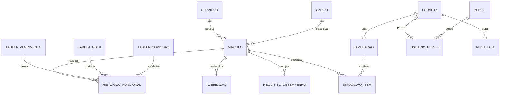

# Especificação de Requisitos: Sistema de Cálculo de Impacto Financeiro (UEFS) - Versão 2.1 - Final

Este documento apresenta a especificação detalhada de requisitos para o desenvolvimento do Sistema de Cálculo de Impacto Financeiro da Pró-Reitoria de Gestão e Desenvolvimento de Pessoas (PGDP) da Universidade Estadual de Feira de Santana (UEFS). A aplicação visa automatizar e unificar os cálculos de impacto financeiro decorrentes de alterações funcionais (promoção, progressão, alteração de carga horária) de servidores docentes e técnicos-administrativos, substituindo as planilhas eletrônicas.

---

## 1. Visão Geral e Arquitetura de Negócio

### 1.1. Contexto Geral
O sistema atende a Pró-Reitoria de Gestão e Desenvolvimento de Pessoas (PGDP) da UEFS. Ele realiza a comparação detalhada entre a remuneração atual do servidor e a remuneração proposta em decorrência de progressão (horizontal), promoção (vertical) ou alteração de carga horária.

### 1.2. Entidades Organizacionais
- **Servidor:** A pessoa física vinculada à universidade.
- **Vínculo (Matrícula):** O contrato de trabalho específico do servidor. A UEFS permite o acúmulo de cargos nos termos do artigo 37, XVI da Constituição Federal (ex: dois cargos de docente). **Todo o cálculo do sistema é baseado no Vínculo, não no Servidor.**
- **Cargo Efetivo:** A carreira ocupada (Docente, Analista Universitário, Técnico Universitário, Auxiliar Administrativo).
- **Cargo em Comissão / Função Gratificada:** Símbolos comissionados (DAS-2A, DAI-4, etc.) associados à estabilidade econômica ou exercício temporário.

---

## 2. Regras de Negócio Detalhadas (RND)

### 2.1. Estrutura de Carreiras e Classificação

#### RND001 - Mapeamento de Classe Docente (Sigla)
Para fins de geração de códigos unificados, a classe por extenso do docente deve ser mapeada para uma sigla padronizada de 3 letras (ou PLENO) segundo a seguinte lógica:
*   `Auxiliar` -> **AUX**
*   `Assistente` -> **ASS**
*   `Adjunto` -> **ADJ**
*   `Titular` -> **TIT**
*   `Pleno` -> **PLENO**

#### RND002 - Código de Identificador de Remuneração-Base Docente
A chave de consulta da tabela salarial de docentes é composta por:
`[Sigla_Classe]-[Nível]-[Carga_Horária]`
*   *Nível:* A ou B.
*   *Carga Horária:* 20, 40 ou DE (Dedicação Exclusiva).
*   *Exemplos:* `AUX-A-20`, `ADJ-B-40`, `TIT-A-DE`.

#### RND003 - Código de Busca de Vencimento-Base (Técnicos e Analistas)
A chave de consulta da tabela salarial para as carreiras de Analista (A), Técnico (T) e Auxiliar (AUX) é composta por:
`[Sigla_Carreira]-[Carga_Horária]-[Grau]`
*   *Sigla Carreira:* `A` (Analista), `T` (Técnico), `AUX` (Auxiliar).
*   *Carga Horária:* 30 ou 40.
*   *Grau:* Numeral romano de I a IV (ou mais, conforme tabela).
*   *Exemplos:* `A-40-I`, `T-30-II`.

#### RND004 - Código de Busca da Gratificação de Suporte Técnico-Universitário (GSTU)
A chave de consulta para a gratificação de suporte técnico-universitário é composta por:
`[Sigla_Carreira]-[Carga_Horária]-[Grau]-[Referência]`
*   *Referência para Analista (A):* `S` (Sem Título), `E` (Especialização), `EE` (Dupla Especialização), `M` (Mestrado), `D` (Doutorado).
*   *Referência para Técnico (T) e Auxiliar (AUX):* `1` (Básica), `2` (Aperfeiçoamento 180h), `3` (Aperfeiçoamento 240h).
*   *Exemplos:* `A-40-IV-M`, `T-40-II-2`.

---

### 2.2. Regras de Interstício e Requisitos de Desenvolvimento

O sistema deve monitorar e disparar alertas referentes ao tempo de serviço (interstício) e requisitos de qualificação necessários para a alteração funcional.

#### RND005 - Interstício de Progressão e Promoção

| Carreira | Evento Funcional | Interstício Mínimo | Requisitos Adicionais |
| :--- | :--- | :--- | :--- |
| **Docente** | Progressão (Nível A para B) | 24 meses de efetivo exercício no Nível A | Avaliação de desempenho favorável. |
| **Docente** | Promoção (Classe) | 24 meses de efetivo exercício na classe atual | Título acadêmico exigido para a nova classe. |
| **Analista (A)** | Progressão Horizontal (Ref.) | 24 meses de efetivo exercício na referência atual | Titulação correspondente à referência proposta. |
| **Analista (A)** | Promoção Vertical (Grau) | 36 meses no grau atual | Aprovação em 1 PFAC + Aptidão em 1 ADF no grau atual. |
| **Técnico (T)** | Progressão Horizontal (Ref.) | 12 meses no Grau I; 18 meses nos Graus II, III e IV | Certificados de cursos de aperfeiçoamento (180h/240h). |
| **Técnico (T)** | Promoção Vertical (Grau) | 36 meses no Grau I; 54 meses nos Graus II e III | Estar na última referência (Ref. 3) do grau ocupado. |

*Nota:* O sistema deve gerar **alertas impeditivos configuráveis**, permitindo que o operador force o cálculo em casos excepcionais (como decisões judiciais), registrando uma justificativa obrigatória na simulação.

---

### 2.3. Motor de Cálculo de Impacto Financeiro (MCIF)

O cálculo compara as parcelas salariais atuais do vínculo com as parcelas propostas. O motor deve computar cada rubrica segundo as definições abaixo:

#### RND006 - Vencimento-Base e Gratificação (GSTU)
Buscados diretamente das tabelas de remuneração vigentes na data de competência da simulação.
*   `Dif_Sal = Vencimento_Novo - Vencimento_Antigo`
*   `Dif_GSTU = GSTU_Nova - GSTU_Antiga` (se aplicável ao cargo).

#### RND007 - Adicional por Tempo de Serviço (ATS)
O ATS (anuênio/quinquênio) é calculado nos termos da Lei Estadual nº 6.677/1994.
1.  **Data Base de ATS:** Se o Vínculo possuir averbações de tempo de serviço válidas para ATS (`Averb_ATS = true`), a data base será:
    `Data_Base_ATS = Data_Admissão - Dias_Averbados_ATS`
    Caso contrário, `Data_Base_ATS = Data_Admissão`.
2.  **Percentual de ATS (%ATS):** Calculado com base na diferença em anos entre a data de vigência do cálculo e a `Data_Base_ATS` (anos inteiros):
    *   `Anos_Serviço = truncar((Data_Vigência - Data_Base_ATS) em dias / 365.25)`
    *   Se `Anos_Serviço < 5`: `%ATS = 0%`
    *   Se `5 <= Anos_Serviço < 6`: `%ATS = 5%` (1º Quinquênio)
    *   Se `Anos_Serviço >= 6`: `%ATS = 5% + (Anos_Serviço - 5)%` (1% adicional por ano completo subsequente).
3.  **Base de Cálculo:** O ATS incide exclusivamente sobre o Vencimento-Base do vínculo.
4.  **Fórmula da Diferença:**
    `Dif_ATS = (%ATS_Novo * Vencimento_Novo) - (%ATS_Antigo * Vencimento_Antigo)`

#### RND008 - Condições Especiais de Trabalho (CET)
A CET é um percentual incidente sobre o Vencimento-Base. O percentual atual e o percentual proposto devem estar registrados no cadastro de simulação do servidor.
*   `Dif_CET = (%CET_Novo * Vencimento_Novo) - (%CET_Antigo * Vencimento_Antigo)`

#### RND009 - Gratificação de Insalubridade
A base de cálculo da insalubridade na Bahia depende de parametrização jurídica (Salário Mínimo ou Vencimento-Base). Por padrão e segurança de auditoria, o sistema utilizará uma base configurável por carreira nas tabelas salariais.
*   `Valor_Insalubridade_Antigo = %Insalubridade_Antiga * Base_Insalubridade_Antiga`
*   `Valor_Insalubridade_Novo = %Insalubridade_Nova * Base_Insalubridade_Novo`
*   `Dif_Insalubridade = Valor_Insalubridade_Novo - Valor_Insalubridade_Antigo`

#### RND010 - Vantagem Pessoal (VPESS)
Trata-se de valor fixo incorporado.
*   `Dif_VPESS = VPESS_Nova - VPESS_Antiga` (Geralmente `Dif_VPESS = 0`, a menos que haja reajuste ou absorção da vantagem).

#### RND011 - Estabilidade Econômica (Estabilização de Função)
Indexado ao valor da Função Comissionada (símbolo) correspondente.
1.  O sistema identifica o símbolo comissionado estabilizado (ex: `DAS-2C`) e o percentual de incorporação (ex: `100%` ou `30%`).
2.  Buscando o valor de vencimento da função comissionada na tabela de comissões vigente:
    `Valor_Estabilidade = Valor_Símbolo * %Estabilizado`
3.  Fórmula da Diferença:
    `Dif_Estab = Valor_Estabilidade_Novo - Valor_Estabilidade_Antigo`

#### RND012 - Encargo Patronal Previdenciário (BAPREV e PREVBAHIA)
1.  **Base de Incidência Previdenciária:** O encargo patronal incide apenas sobre as rubricas de caráter permanente que compõem a remuneração de contribuição (Vencimento-Base, GSTU, ATS, VPESS, Estabilidade Econômica). CET e Insalubridade devem possuir flags de incidência no cadastro de rubricas.
    `Base_Incidencia = Dif_Sal + Dif_GSTU + Dif_ATS + Dif_VPESS + Dif_Estab + (Dif_CET se incidir) + (Dif_Insalubridade se incidir)`
2.  **Alíquota Patronal e Teto Previdenciário:**
    *   **Admitidos até 31/12/2007:** Alíquota de **24%** incidentes sobre a totalidade da `Base_Incidencia`.
    *   **Admitidos de 01/01/2008 até 2015:** Alíquota de **28%** incidentes sobre a totalidade da `Base_Incidencia`.
    *   **Admitidos após a instituição da Previdência Complementar (PREVBAHIA - pós-2015):** 
        *   O encargo patronal básico (BAPREV) de **28%** incide apenas até o teto do RGPS vigente na competência de cálculo.
        *   Sobre o valor excedente ao teto do RGPS, o encargo patronal complementar (PREVBAHIA) incide na alíquota de coparticipação paritária definida na adesão do servidor (limitada a 8%), caso o servidor seja participante ativo do plano complementar. Se não for aderente, não há encargo patronal sobre o excedente.

---

### 2.4. Temporalidade, Proporcionalidade e Retroativos

#### RND013 - Vigência Proporcional Diária e Arredondamento Matemático
Caso a data de vigência da alteração funcional ocorra no meio do mês de competência, o cálculo daquele mês deve ser feito de forma proporcional aos dias sob a seguinte metodologia passo a passo:
1.  **Cálculo dos Dias de Vigência:**
    *   `Dias_Antigo = Dia_Vigência - 1`
    *   `Dias_Novo = 30 - Dias_Antigo` (Todos os meses comerciais são tratados como 30 dias na folha padrão).
2.  **Determinação do Valor Proporcional Diário Intermediário (`Valor_Diario`):**
    *   `Valor_Diario = Diferença_Mensal_Rubrica / 30.0`
    *   **Regra de Arredondamento Intermediário:** O resultado da divisão do valor diário deve ser **truncado na 3ª casa decimal** (ex: R$ 880,00 / 30 = 29,33333... -> R$ 29,333) para mitigar distorções de centavos por arredondamento cumulativo.
3.  **Cálculo da Proporcionalidade Final da Rubrica:**
    *   `Valor_Proporcional_Final = Valor_Diario * Dias_Novo`
    *   **Regra de Arredondamento Financeiro Final:** Sobre o valor resultante de cada rubrica individual calculada no passo anterior, aplica-se o arredondamento financeiro padrão de **duas casas decimais** (se a 3ª casa decimal for maior ou igual a 5, arredonda para cima a 2ª casa; se for inferior a 5, mantém-se a 2ª casa).
    *   *Fórmula final por rubrica:* `Impacto_Mês_Transição = arredondar_2_casas(Valor_Diario * Dias_Novo)`

#### RND014 - Impacto no Primeiro Ano (Ano de Vigência)
O impacto financeiro total no primeiro ano civil (de janeiro a dezembro) é a soma de:
1.  **Meses Completos:** Impacto mensal integral multiplicado pelo número de meses cheios a partir da vigência até dezembro.
2.  **Mês de Transição:** Fração proporcional calculada em RND013.
3.  **Proporcionalidade de 13º Salário:** No serviço público baiano, a gratificação natalina baseia-se na remuneração de dezembro. O impacto financeiro no 13º no ano de vigência é:
    *   Se a vigência ocorrer até 31/12: O servidor receberá o 13º integralizado no novo valor. Portanto, a diferença de 13º no primeiro ano é igual a `1.0 * Diferença_Remuneração_Integral`.
4.  **Proporcionalidade de Férias:** O terço de férias incide sobre a remuneração do mês de gozo. O sistema deve coletar o "Mês de Gozo de Férias".
    *   Se o gozo de férias ocorrer antes do mês de vigência: impacto no 1/3 de férias no 1º ano = **0**.
    *   Se ocorrer no mês ou após o mês de vigência: impacto no 1/3 de férias no 1º ano = `1/3 * Diferença_Remuneração_Integral`.

#### RND015 - Retroativos em Múltiplas Vigências de Tabelas
Quando a vigência funcional retroagir a períodos anteriores, o motor de cálculo deve aplicar a tabela salarial correspondente a cada período retroativo, respeitando os reajustes gerais de tabela que ocorreram no intervalo.

---

## 3. Modelo de Dados Lógico (MDL)

Para suportar as regras de múltiplos vínculos, vigências de tabelas, simulações com controle de concorrência e o controle de acesso baseado em perfis (RBAC), propõe-se o seguinte modelo lógico de dados.

### 3.1. Diagrama de Relacionamentos (Mermaid)



### 3.2. Dicionário de Tabelas Principal

#### Tabela: `servidor`
Guarda as informações civis exclusivas da pessoa física.
*   `id` (UUID, PK): Identificador único.
*   `cpf` (VARCHAR(11), Unique): CPF do servidor.
*   `nome` (VARCHAR(150)): Nome completo.
*   `data_nascimento` (DATE): Data de nascimento.

#### Tabela: `vinculo`
Identifica o contrato de trabalho (matrícula). Permite múltiplos vínculos para o mesmo CPF.
*   `id` (UUID, PK)
*   `servidor_id` (UUID, FK -> `servidor.id`)
*   `matricula` (VARCHAR(20), Unique): Matrícula funcional.
*   `data_admissao` (DATE): Data de ingresso no cargo efetivo.
*   `cargo_id` (UUID, FK -> `cargo.id`)
*   `regime_previdenciario` (ENUM): `BAPREV_REGIME_PROPRIO`, `PREVBAHIA_COMPLEMENTAR`.
*   `participante_prev_complementar` (BOOLEAN): Flag de adesão ao plano de coparticipação.
*   `aliquota_coparticipacao_complementar` (DECIMAL(4,2)): Percentual de adesão (ex: 8.00).
*   `tipo_vinculo` (ENUM): `ESTATUTARIO`, `REDA`, `CLT`.
*   `ativo` (BOOLEAN): Status do vínculo.

#### Tabela: `averbacao`
Tempo de serviço anterior averbado para fins de concessão de vantagens ou aposentadoria.
*   `id` (UUID, PK)
*   `vinculo_id` (UUID, FK -> `vinculo.id`)
*   `dias_averbados` (INTEGER): Quantidade de dias.
*   `tipo_averbacao` (ENUM): `ATS` (Adicional Tempo Serviço), `APOSENTADORIA` (Apenas aposentadoria).
*   `data_averbacao` (DATE): Data do deferimento da averbação.
*   `processo_numero` (VARCHAR(50)): Processo administrativo de averbação.

#### Tabela: `cargo`
*   `id` (UUID, PK)
*   `nome` (VARCHAR(100)): Nome do cargo.
*   `tipo` (ENUM): `DOCENTE`, `ANALISTA`, `TECNICO`, `AUXILIAR`.
*   `carga_horaria_padrao` (INTEGER): 20, 30, 40.

#### Tabela: `tabela_vencimento`
Tabela histórica de remunerações base.
*   `id` (UUID, PK)
*   `codigo_vencimento` (VARCHAR(20)): Ex: `AUX-A-20`, `A-40-I`.
*   `classe` (VARCHAR(50)): Classe correspondente.
*   `nivel_grau` (VARCHAR(10)): Nível (A/B) ou Grau (I, II, III).
*   `carga_horaria` (INTEGER)
*   `valor_base` (DECIMAL(12,2)): Valor salarial.
*   `data_inicio_vigencia` (DATE): Início da validade da tabela.
*   `data_fim_vigencia` (DATE, Nullable): Fim da validade da tabela (null se atual).

#### Tabela: `tabela_gstu`
Histórico de gratificações GSTU.
*   `id` (UUID, PK)
*   `codigo_gstu` (VARCHAR(30)): Ex: `A-40-IV-M`, `T-40-II-2`.
*   `grau` (VARCHAR(10))
*   `referencia` (VARCHAR(10))
*   `valor_gstu` (DECIMAL(12,2))
*   `data_inicio_vigencia` (DATE)
*   `data_fim_vigencia` (DATE, Nullable)

#### Tabela: `tabela_comissao`
Histórico de valores de símbolos comissionados para estabilidade econômica.
*   `id` (UUID, PK)
*   `simbolo` (VARCHAR(10)): Ex: `DAS-2C`, `DAI-4`.
*   `valor_comissao` (DECIMAL(12,2))
*   `data_inicio_vigencia` (DATE)
*   `data_fim_vigencia` (DATE, Nullable)

#### Tabela: `historico_funcional`
O estado real de alocação do vínculo no tempo (tabela histórica de movimentações reais).
*   `id` (UUID, PK)
*   `vinculo_id` (UUID, FK -> `vinculo.id`)
*   `data_inicio` (DATE): Data da posse na alteração/enquadramento.
*   `data_fim` (DATE, Null): Data em que deixou de vigorar aquela situação funcional.
*   `tabela_vencimento_id` (UUID, FK -> `tabela_vencimento.id`)
*   `tabela_gstu_id` (UUID, FK -> `tabela_gstu.id`, Nullable)
*   `cet_percentual` (DECIMAL(5,2)): Ex: 125.00
*   `insalubridade_percentual` (DECIMAL(5,2)): Ex: 20.00
*   `vpess_valor` (DECIMAL(12,2)): Vantagem pessoal individual.
*   `tabela_comissao_id` (UUID, FK -> `tabela_comissao.id`, Nullable)
*   `percentual_estabilizado` (DECIMAL(5,2)): Percentual de estabilização do símbolo.

#### Tabela: `simulacao`
Instância de simulação (cenário) criada pelos analistas para isolamento de dados.
*   `id` (UUID, PK)
*   `descricao` (VARCHAR(200)): Nome da simulação (ex: "Promoção Docentes 2026").
*   `tipo` (ENUM): `INDIVIDUAL`, `LOTE`.
*   `status` (ENUM): `RASCUNHO`, `PROCESSANDO`, `FINALIZADO`, `ERRO`.
*   `criado_por_usuario_id` (UUID, FK -> `usuario.id`): Identificador do analista/administrador que criou o lote.
*   `data_criacao` (TIMESTAMP)

#### Tabela: `simulacao_item`
Detalhes de cada simulação de vínculo no cenário de simulação.
*   `id` (UUID, PK)
*   `simulacao_id` (UUID, FK -> `simulacao.id` ON DELETE CASCADE)
*   `vinculo_id` (UUID, FK -> `vinculo.id`)
*   `data_vigencia_proposta` (DATE)
*   `mes_gozo_ferias_proposto` (INTEGER): Mês de férias na vigência.
*   `dados_origem_json` (JSONB): Cópia do estado funcional no momento da simulação.
*   `dados_propostos_json` (JSONB): Objeto com a alteração simulada (novo vencimento_id, novo gstu_id, nova CET, etc.).
*   `resultado_calculo_json` (JSONB): Armazena os valores calculados detalhados rubrica por rubrica (atual, proposto e diferenças) para exibição imediata e exportação de PDF.
*   `justificativa_requisitos` (TEXT, Nullable): Justificativa obrigatória se houver violação de interstício.

#### Tabela: `usuario`
Cadastro de usuários autorizados a acessar o sistema.
*   `id` (UUID, PK): Identificador único do usuário.
*   `username` (VARCHAR(50), Unique): Login de usuário.
*   `senha_hash` (VARCHAR(255)): Hash criptográfico da senha.
*   `nome` (VARCHAR(100)): Nome do servidor operador.
*   `email` (VARCHAR(100), Unique): Email corporativo.
*   `ativo` (BOOLEAN): Status do usuário no sistema.
*   `criado_em` (TIMESTAMP): Data de cadastro do usuário.

#### Tabela: `perfil`
Perfis de controle de acesso do sistema (RBAC).
*   `id` (UUID, PK): Identificador único.
*   `nome` (VARCHAR(50), Unique): Identificação do perfil (ex: `ADMINISTRADOR`, `ANALISTA_RH`, `AUDITOR`).
*   `descricao` (VARCHAR(200)): Descrição das atribuições do perfil.

#### Tabela: `usuario_perfil`
Tabela associativa de relacionamento N:N entre Usuários e Perfis.
*   `usuario_id` (UUID, FK -> `usuario.id` ON DELETE CASCADE)
*   `perfil_id` (UUID, FK -> `perfil.id` ON DELETE CASCADE)
*   *PK composta:* (`usuario_id`, `perfil_id`)

#### Tabela: `audit_log`
Registro central de trilhas de auditoria de ações críticas e parâmetros globais.
*   `id` (UUID, PK): Identificador do log.
*   `usuario_id` (UUID, FK -> `usuario.id`, Nullable): Operador responsável (nulo se executado por rotina de sistema).
*   `tabela_afetada` (VARCHAR(50)): Nome da tabela modificada (ex: `tabela_vencimento`, `usuario`).
*   `registro_id` (UUID): ID do registro modificado na tabela afetada.
*   `operacao` (ENUM): `INSERT`, `UPDATE`, `DELETE`, `LOGIN`, `SIMULACAO_EXECUCAO`.
*   `payload_antigo` (JSONB, Nullable): Dados do registro antes da alteração.
*   `payload_novo` (JSONB, Nullable): Dados do registro inseridos/atualizados.
*   `ip_origem` (VARCHAR(45)): IP de onde partiu a requisição.
*   `data_hora` (TIMESTAMP): Data/hora exata do evento.

---

## 4. Requisitos Funcionais (RF) - Detalhamento e Critérios de Aceite

Abaixo estão detalhados os Requisitos Funcionais classificados como **MUST HAVE**, com seus respectivos critérios de aceitação no formato de histórias de usuário (BDD/Gherkin).

### RF001 - Importação de Base de Servidores Ativos
**História de Usuário:**
Como analista de RH da PGDP, quero realizar o upload de um arquivo CSV contendo os dados cadastrais e funcionais dos servidores ativos para que o sistema possa atualizar a base de dados interna de forma consolidada.

**Regras de Negócio e Validações:**
1.  **Formato do Arquivo:** O arquivo deve ser no formato CSV, com delimitador `;` (ponto e vírgula) e codificação `UTF-8` ou `ISO-8859-1`.
2.  **Campos Obrigatórios:** CPF, Matrícula, Nome, Data de Admissão, Código do Cargo, Código de Vencimento Atual, Código de GSTU Atual (se aplicável), Percentual de CET atual, Percentual de Insalubridade atual, Valor da Vantagem Pessoal atual, Símbolo de Estabilidade Econômica (se aplicável), Percentual de Estabilidade (se aplicável).
3.  **Integridade Referencial:** O CPF deve ser validado (algoritmo padrão). A matrícula deve ser exclusiva. Os códigos de vencimento e GSTU contidos no arquivo devem existir nas tabelas salariais cadastradas previamente.
4.  **Log de Erros:** O sistema não deve processar o arquivo se houver erros estruturais críticos. Em caso de registros inválidos, o sistema deve abortar a transação (atomicidade) e listar os erros contendo: Número da Linha, Coluna, Valor Rejeitado e Motivo.

**Critérios de Aceite:**
```gherkin
Cenário: Upload de arquivo CSV válido e sem erros cadastrais
  Dado que o analista de RH está autenticado e acessa a página de importação de servidores
  Quando ele seleciona um arquivo CSV com dados válidos contendo 500 registros de servidores
  E clica no botão "Processar Importação"
  Então o sistema deve ler o arquivo na codificação selecionada
  E validar a integridade de todas as colunas de todos os registros
  E persistir os dados nas tabelas "servidor", "vinculo" e "historico_funcional"
  E exibir uma mensagem de sucesso: "Importação concluída com sucesso. 500 registros inseridos/atualizados."

Cenário: Upload de arquivo CSV com CPFs inválidos ou dados ausentes
  Dado que o analista de RH está na página de importação de servidores
  Quando ele seleciona um arquivo CSV que contém 2 registros com CPFs inválidos e 1 registro sem o campo "Matrícula"
  E clica no botão "Processar Importação"
  Então o sistema deve rejeitar o processamento do arquivo inteiro (rollback da transação)
  E exibir um relatório de inconsistências detalhado
  E o relatório deve listar: "Linha 14: CPF inválido (123.456.789-00)", "Linha 42: Campo obrigatório 'Matrícula' ausente."

Cenário: Incompatibilidade de códigos salariais com a tabela unificada
  Dado que o analista de RH está na página de importação de servidores
  Quando ele faz o upload de um CSV contendo o código de vencimento "A-40-V" que não está cadastrado no sistema
  Então o sistema deve impedir a importação
  E retornar o erro: "Erro na linha 5: O código salarial 'A-40-V' não consta nas Tabelas Salariais vigentes."
```

---

### RF002 - Cadastro Histórico de Tabelas Salariais
**História de Usuário:**
Como analista de RH administrador do sistema, quero cadastrar e atualizar as tabelas de vencimento-base, GSTU e símbolos de comissão com suas respectivas vigências para garantir a exatidão dos cálculos retroativos históricos.

**Regras de Negócio e Validações:**
1.  **Vigência Temporal:** Cada registro da tabela salarial deve conter um período de validade delimitado por `Data_Início` e `Data_Fim` (se ativo atualmente, `Data_Fim` deve ser nula).
2.  **Prevenção de Sobreposição:** O sistema não deve permitir que um mesmo código (ex: `A-40-I`) possua períodos de vigência sobrepostos no banco de dados. Ao inserir uma nova vigência para um código existente, a vigência anterior deve ser fechada automaticamente (`Data_Fim` preenchida com a véspera da nova data de início).

**Critérios de Aceite:**
```gherkin
Cenário: Inclusão de novo reajuste salarial fechando vigência anterior
  Dado que existe uma tabela salarial vigente para o código "A-40-I" de "01/01/2025" a "Sem Data Fim" com valor de R$ 5.000,00
  Quando o administrador cadastra um novo valor de R$ 5.500,00 para "A-40-I" com vigência a partir de "01/05/2026"
  Então o sistema deve atualizar a tabela salarial antiga definindo a "Data_Fim" como "30/04/2026"
  E salvar a nova linha com valor R$ 5.500,00, "Data_Início" em "01/05/2026" e "Data_Fim" como nula
  E exibir mensagem de sucesso: "Tabela atualizada. Nova vigência inserida e vigência anterior encerrada."

Cenário: Tentativa de inserção com período sobreposto conflitante
  Dado que existe uma vigência ativa para o código "T-30-II" de "01/01/2025" a "31/12/2025"
  Quando o administrador tenta inserir uma nova vigência de "01/06/2025" a "30/06/2026"
  Então o sistema deve rejeitar o cadastro
  E exibir mensagem de alerta: "Conflito de vigência: O código 'T-30-II' já possui valores definidos para o período solicitado."
```

---

### RF003 & RF004 - Motor de Cálculo Individual e Memória de Cálculo (PDF)
**História de Usuário:**
Como analista de RH da PGDP, quero selecionar um servidor por sua matrícula, simular uma alteração funcional informando novos parâmetros e gerar um arquivo PDF consolidado com a memória de cálculo para formalizar o parecer no processo administrativo físico/SEI.

**Regras de Negócio e Validações:**
1.  **Parâmetros de Entrada:** O sistema deve solicitar: Matrícula do servidor (busca), Nova Carga Horária, Nova Classe/Grau, Nova Referência, Nova Data de Vigência, Novo Percentual de CET e Mês de Gozo de Férias Proposto.
2.  **Geração dos Valores:** O motor calcula os valores atuais e propostos com base nas vigências e regras detalhadas no item 2.3.
3.  **PDF de Memória de Cálculo:** O PDF gerado deve conter:
    *   Cabeçalho institucional da UEFS e identificação do servidor (Nome, CPF, Matrícula, Cargo Efetivo).
    *   Tabela comparativa contendo: Nome da Rubrica, Valor Atual, Valor Proposto, Diferença Nominal e Percentual de Incidência de Encargo.
    *   Detalhamento de Proporcionalidade: Projeção de impacto no 1º Ano (indicando a fração de meses) e reflexos no 13º e férias.
    *   Totalização do Encargo Patronal Mensal e Anual.
    *   Assinatura digital/sistema do analista que realizou a simulação e data/hora.

**Critérios de Aceite:**
```gherkin
Cenário: Simulação de progressão de Analista com vigência no meio do mês
  Dado que o servidor João possui o vínculo atual "A-40-I" com Vencimento R$ 4.000,00 e ATS de 10% (R$ 400,00)
  Quando o analista simula uma progressão para "A-40-II" com Vencimento R$ 4.800,00 e mesma alíquota de ATS
  E define a data de vigência para "16/05/2026" (competência maio/2026)
  Então o sistema deve calcular o impacto mensal cheio como: Vencimento R$ 800,00 + ATS R$ 80,00 = R$ 880,00
  E deve calcular o impacto proporcional no mês de transição (maio) correspondente a 15 dias (16 a 30): R$ 440,00
  E deve calcular o encargo patronal (28%) sobre a base incidente
  E exibir os valores detalhados em tela

Cenário: Geração do documento PDF de Memória de Cálculo
  Dado que a simulação individual descrita no cenário anterior foi concluída
  Quando o analista clica no botão "Gerar Memória de Cálculo (PDF)"
  Então o sistema deve renderizar o arquivo PDF padronizado com os dados do servidor João
  E o PDF deve exibir a tabela comparativa contendo a base atual de R$ 4.400,00, a proposta de R$ 5.280,00, o impacto de R$ 880,00 e os cálculos patronais
  E o download do arquivo deve iniciar automaticamente com o nome "memoria_calculo_matricula_[MATRICULA].pdf"
```

---

### RF005 - Simulação Coletiva e Controle de Lotes
**História de Usuário:**
Como gestor da PGDP, quero simular o impacto orçamentário anual de um lote de promoções e progressões de toda uma carreira, para subsidiar decisões sobre limites prudenciais da Lei de Responsabilidade Fiscal (LRF).

**Regras de Negócio e Validações:**
1.  **Filtros de Grupo:** Permitir selecionar por Carreira (ex: Docentes), Classe (ex: Adjunto), Grau ou tempo de interstício mínimo vencido.
2.  **Processamento em Segundo Plano (Fila):** Simulações coletivas acima de 50 servidores devem ser enviadas para uma fila de processamento assíncrono para evitar lentidão e timeout na aplicação web.
3.  **Resultados:** Exibição do custo adicional mensal global do lote, custo anual com 13º e férias somados e o custo correspondente do encargo previdenciário patronal totalizado.

**Critérios de Aceite:**
```gherkin
Cenário: Simulação coletiva em lote via processamento assíncrono
  Dado que o gestor da PGDP seleciona o filtro de carreira "Analistas Universitários"
  E seleciona a alteração proposta para progredir todos do Grau I para o Grau II
  E o lote resultante possui 150 servidores elegíveis
  Quando ele clica em "Processar Simulação Coletiva"
  Então o sistema deve criar uma simulação com status "PROCESSANDO"
  E processar o motor de cálculo para cada servidor de forma assíncrona
  E redirecionar o usuário para a tela de progresso da simulação
  E atualizar o status para "FINALIZADO" ao concluir, exibindo o impacto orçamentário consolidado
```

---

### RF007 - Carga e Gestão do Histórico Funcional Legado
**História de Usuário:**
Como analista de RH da PGDP, quero realizar a carga e o gerenciamento das linhas de movimentações históricas dos servidores (mudanças passadas de referência, classe, carga horária, CET, etc.) para que o motor de cálculo possa computar retroativos históricos de forma precisa.

**Regras de Negócio e Validações:**
1.  **Estratégias de Carga:** O sistema deve suportar três estratégias para a população da tabela `historico_funcional`:
    *   **A. Importação via Arquivo CSV de Histórico:** O sistema fornecerá uma funcionalidade para upload do arquivo `historico_funcional_import.csv` contendo a série histórica de enquadramentos de cada vínculo. Colunas exigidas: `Matrícula`, `Data_Início`, `Data_Fim` (vazio se atual), `Código_Vencimento`, `Código_GSTU` (se houver), `CET_Percentual`, `Insalubridade_Percentual`, `VPESS_Valor`, `Símbolo_Estabilizado`, `Percentual_Estabilizado`.
    *   **B. Alimentação Manual via Prontuário:** A tela de prontuário eletrônico do servidor deve conter uma seção de "Histórico Funcional" permitindo que o analista insira, remova ou edite registros históricos manualmente.
    *   **C. Fallback Automático de Carga Inicial:** Ao executar um enquadramento inicial do RF001, o sistema cria automaticamente um primeiro registro correspondente no histórico funcional cuja `Data_Início` é a `Data_Admissão` do servidor e `Data_Fim` nula (representando o enquadramento estável original na ausência de base de histórico legado detalhada).
2.  **Validação de Consistência Temporal:** As datas de início e fim dos registros do histórico funcional de um mesmo vínculo não podem se sobrepor sob hipótese alguma.

**Critérios de Aceite:**
```gherkin
Cenário: Importação de histórico legado via arquivo CSV estruturado
  Dado que o analista de RH está autenticado e acessa a página de importação de histórico
  Quando ele faz o upload de um CSV estruturado contendo a série histórica de enquadramentos de 50 servidores
  E clica em "Importar Série Histórica"
  Então o sistema deve validar se as matrículas fornecidas existem na base e se as datas de início/fim não se sobrepõem
  E persistir os enquadramentos passados na tabela "historico_funcional"
  E exibir mensagem de sucesso contendo os registros importados.

Cenário: Cadastro manual de movimentação histórica no prontuário do servidor
  Dado que o analista de RH está no prontuário do servidor matrícula "102030"
  Quando ele insere manualmente uma movimentação antiga com Vencimento "A-40-I", CET 30%, início "01/01/2022" e fim "31/12/2024"
  Então o sistema valida que esse período não colide com as demais faixas salariais cadastradas do servidor
  E persiste o registro histórico.

Cenário: Rejeição de histórico com sobreposição temporal
  Dado que o servidor possui um histórico registrado de "01/01/2023" a "31/12/2024"
  Quando o analista tenta cadastrar uma nova linha de histórico de "01/06/2024" a "30/06/2025" para a mesma matrícula
  Então o sistema bloqueia a gravação e retorna erro: "Violação de consistência: O período solicitado se sobrepõe ao enquadramento existente."
```

---

## 5. Requisitos Não Funcionais (RNF) - Detalhamento Técnico

### RNF001 - Precisão de Cálculo e Padrão Monetário
- **Tipo de Dado:** Todos os valores monetários calculados no backend e persistidos no banco de dados devem utilizar o tipo de dado numérico de ponto fixo (como `NUMERIC(12,2)` ou `DECIMAL(12,2)`) para evitar erros de aproximação de ponto flutuante.
- **Precisão:** Arredondamento matemático padrão de duas casas decimais (meio para cima).

### RNF002 - Controle de Concorrência e Transação de Simulações
- **Isolamento de Dados:** Cada simulação individual ou em lote pertence a um registro de cenário único na tabela `simulacao`. As alterações propostas durante a simulação modificam apenas a tabela `simulacao_item` do cenário do analista logado.
- Isso previne colisões de concorrência onde dois analistas simulam o enquadramento do mesmo servidor de formas diferentes. As tabelas reais (`servidor`, `vinculo`, `historico_funcional`) atuam estritamente como "somente leitura" durante a simulação de impacto.

### RNF003 - Performance de Resposta
- Simulações individuais de servidores ativos devem retornar os resultados e renderizar a memória de cálculo na interface em um tempo inferior a **800 milissegundos**.
- Consultas consolidadas de lotes pré-processados devem carregar em menos de **1,5 segundos**.

### RNF004 - Segurança, Auditoria e Trilha de Eventos de Simulação
- Cada simulação executada que gerar uma Memória de Cálculo oficial deve gerar um registro de auditoria na tabela `audit_log` contendo a identificação do usuário analista (`usuario_id`), IP de acesso, dados da simulação (`registro_id` mapeado para o ID da simulação) e o tipo de operação `SIMULACAO_EXECUCAO`.

### RNF005 - Controle de Acesso Baseado em Perfis (RBAC)
O sistema deve implementar autenticação e autorização estritas baseadas em perfis de acesso (RBAC), definindo as seguintes permissões básicas para cada nível de perfil cadastrado:
1.  **Perfil ADMINISTRADOR:**
    *   Acesso irrestrito a todas as funcionalidades do sistema.
    *   Gestão de usuários, perfis e permissões.
    *   CRUD completo de Tabelas Salariais (`tabela_vencimento`, `tabela_gstu`, `tabela_comissao`).
    *   Importação e expurgo de dados cadastrais/funcionais de servidores.
2.  **Perfil ANALISTA_RH:**
    *   Visualização (somente leitura) de tabelas salariais de parâmetros globais.
    *   Gestão e consulta de Prontuário de Servidores e Históricos Funcionais.
    *   Permissão completa para criar, processar, editar e excluir simulações individuais e em lote, além de gerar arquivos PDF de Memórias de Cálculo.
    *   Sem acesso à área de configurações de sistema ou cadastro de usuários.
3.  **Perfil AUDITOR:**
    *   Acesso somente leitura a relatórios, simulações consolidadas, dados de servidores e memórias de cálculo.
    *   Acesso especial de somente leitura aos logs da tabela `audit_log`.

### RNF006 - Rastreabilidade e Auditoria de Parâmetros Globais
- **Escopo:** Toda operação de criação (`INSERT`), alteração (`UPDATE`) ou exclusão (`DELETE`) de registros nas tabelas paramétricas de base salarial (`tabela_vencimento`, `tabela_gstu`, `tabela_comissao`) e na tabela de controle de acesso (`usuario`, `perfil`, `usuario_perfil`) deve gerar, sob a mesma transação de banco de dados, um registro correspondente na tabela `audit_log`.
- **Conteúdo de Rastreabilidade:** O registro na tabela `audit_log` deve obrigatoriamente preencher os campos `payload_antigo` e `payload_novo` em formato JSONB, contendo os valores completos do registro antes e depois da operação, garantindo auditabilidade retroativa absoluta de reajustes orçamentários.
- **Atomicidade:** Se a gravação na tabela `audit_log` falhar por qualquer razão, a operação correspondente de alteração de parâmetros deve sofrer rollback automático de transação.
