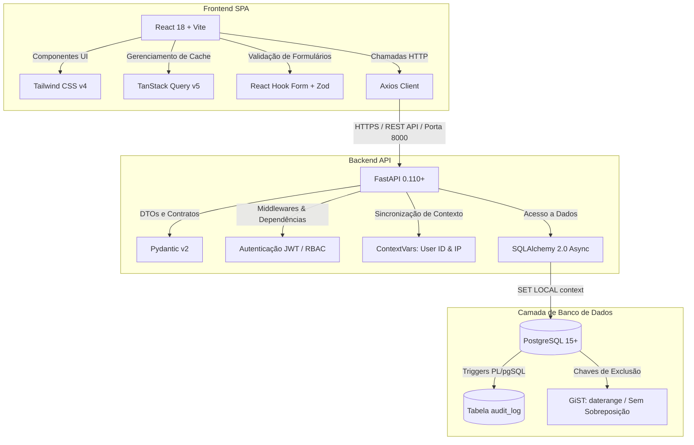
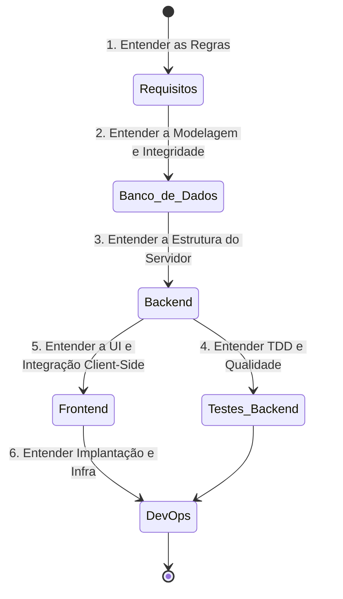

# Blueprint & Master Index - Sistema de Cálculo de Impacto Financeiro da UEFS

Este documento serve como a **Página Inicial (Blueprint)** do projeto de desenvolvimento do **Sistema de Cálculo de Impacto Financeiro** da Pró-Reitoria de Gestão e Desenvolvimento de Pessoas (PGDP) da Universidade Estadual de Feira de Santana (UEFS). 

Aqui, novos membros da equipe e auditores de sistemas encontrarão a visão macro do projeto, as diretrizes de integração entre as especificações e o mapa de navegação de todo o dossiê arquitetural.

---

## 1. Introdução ao Sistema

O **Sistema de Cálculo de Impacto Financeiro** foi concebido para automatizar e unificar o cálculo orçamentário decorrente de evoluções de carreiras funcionais (promoção vertical, progressão horizontal e alterações de carga horária) de servidores públicos (docentes e técnicos/analistas universitários) da UEFS. 

A aplicação substitui planilhas manuais propensas a erros de precisão, oferecendo um motor de cálculo robusto baseado nas leis estaduais (ex: Lei Estadual nº 6.677/1994), suporte a múltiplos vínculos por CPF, simulações isoladas por lotes orçamentários, e um sistema de auditoria transacional atômica e rastreabilidade total (RBAC).

---

## 2. Arquitetura Macro da Solução

O sistema é desenhado sob o paradigma de **Microsserviços de Responsabilidade Única**, estruturado em uma arquitetura de três camadas (React Client -> FastAPI Server -> PostgreSQL Database).

---

## 3. Dossiê de Especificações Técnicas

Abaixo está o índice completo dos documentos que compõem a arquitetura da solução. Clique nos links para acessar o detalhamento de cada área do projeto.

1.  **[Especificacao_Requisitos.md](file:///home/manoel/projetos/paranaue/docs/Especificacao_Requisitos.md)**
    *   **Responsabilidade**: Define as regras de negócio detalhadas (RNDs) para o enquadramento de carreiras, cálculo de ATS, CET, insalubridade, estabilidade econômica e proporcionalidades de transição mensal, além do dicionário de dados lógico e matriz de acesso baseada em perfis (RBAC).
2.  **[Especificacao_Arquitetura_Banco_Dados.md](file:///home/manoel/projetos/paranaue/docs/Especificacao_Arquitetura_Banco_Dados.md)**
    *   **Responsabilidade**: Detalha o modelo físico (DDL) do banco de dados PostgreSQL 15, as restrições temporais de sobreposição via chaves de exclusão GiST com `daterange`, os triggers PL/pgSQL de auditoria de dados paramétricos e a estratégia de índices de performance (GIN e FKs).
3.  **[Especificacao_Arquitetura_Backend.md](file:///home/manoel/projetos/paranaue/docs/Especificacao_Arquitetura_Backend.md)**
    *   **Responsabilidade**: Documenta o design pattern do backend em FastAPI com SQLAlchemy 2.0 Async, a estratégia automática de integração dos `ContextVars` (usuário e IP) com o evento `after_begin` do banco de dados, os endpoints RESTful e a conteinerização em Docker.
4.  **[Especificacao_Testes_Backend.md](file:///home/manoel/projetos/paranaue/docs/Especificacao_Testes_Backend.md)**
    *   **Responsabilidade**: Estabelece o fluxo obrigatório de Test-Driven Development (TDD), o padrão AAA, fixtures em `conftest.py` para isolamento de testes assíncronos e verificação física no PostgreSQL de triggers de auditoria e exclusão temporal.
5.  **[Especificacao_Arquitetura_Frontend.md](file:///home/manoel/projetos/paranaue/docs/Especificacao_Arquitetura_Frontend.md)**
    *   **Responsabilidade**: Apresenta a arquitetura do cliente React + Vite com TypeScript e Tailwind CSS v4, o controle de estado e cache via TanStack Query, interceptores Axios para sessões seguras e o roteador protegido por RBAC.
6.  **[Especificacao_Arquitetura_DevOps.md](file:///home/manoel/projetos/paranaue/docs/Especificacao_Arquitetura_DevOps.md)**
    *   **Responsabilidade**: Detalha a infraestrutura local (orquestração via `docker-compose.yml` para Dev) e de produção (orquestração via `docker-compose.prod.yml` para VPS), estratégias de variáveis de ambiente (`.env`), playbooks de deploy manual e procedimentos de rollback.

---

## 4. Ordem Recomendada de Leitura para Novos Desenvolvedores

Para obter uma curva de aprendizado suave e acelerar o onboarding no projeto, sugerimos que os novos membros da equipe leiam a documentação seguindo a sequência abaixo:

1.  **Etapa 1: Regras e Requisitos** (Comece por [Requisitos](file:///home/manoel/projetos/paranaue/docs/Especificacao_Requisitos.md))
    *   *Objetivo*: Compreender a lógica de carreiras da UEFS, como as regras financeiras incidem sobre as remunerações e como as vigências salariais operam no tempo.
2.  **Etapa 2: Persistência e Integridade** (Siga para [Banco de Dados](file:///home/manoel/projetos/paranaue/docs/Especificacao_Arquitetura_Banco_Dados.md))
    *   *Objetivo*: Visualizar as tabelas físicas, os enums cadastrados e compreender como as chaves GiST previnem colisões temporais salariais diretamente no PostgreSQL.
3.  **Etapa 3: Arquitetura de Serviços API** (Leia [Backend](file:///home/manoel/projetos/paranaue/docs/Especificacao_Arquitetura_Backend.md))
    *   *Objetivo*: Compreender a estrutura de camadas do FastAPI, DTOs Pydantic, e a captura automatizada do contexto de requisição (IP e usuário) enviada aos triggers.
4.  **Etapa 4: Padrão de Qualidade** (Avance para [Testes Backend](file:///home/manoel/projetos/paranaue/docs/Especificacao_Testes_Backend.md))
    *   *Objetivo*: Alinhar-se às regras do TDD, entender como simular e testar as transações e o isolamento de sessões com rollback automático no PostgreSQL.
5.  **Etapa 5: Interface do Analista** (Estude [Frontend](file:///home/manoel/projetos/paranaue/docs/Especificacao_Arquitetura_Frontend.md))
    *   *Objetivo*: Compreender a navegação por features no React, o controle de acesso de rotas por papel de usuário (RBAC) e a injeção do cache de dados do TanStack Query.
6.  **Etapa 6: Deploy e Ambientes** (Conclua com [DevOps](file:///home/manoel/projetos/paranaue/docs/Especificacao_Arquitetura_DevOps.md))
    *   *Objetivo*: Configurar o arquivo `.env.local` na máquina local, subir a stack completa via `docker compose` com hot-reload ativo e rodar scripts de sanity check e deploy.
